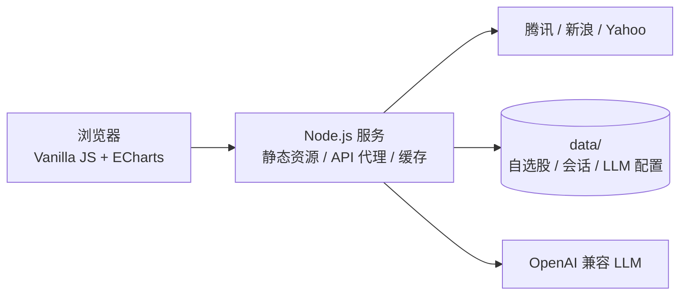

# Stock Dashboard · A股 / 港股 / 美股行情看板

一个可自托管、零 npm 依赖的多市场行情看板。聚合指数、涨跌榜、分时与 K 线、行业板块、财经新闻和自选股，并通过 OpenAI 兼容接口提供带实时行情上下文的 AI 问答。


<p align="center">
  
</p>

## 核心亮点

| 能力 | 说明 |
|---|---|
| 多市场行情 | 在同一界面查看 A股、港股、美股指数、涨跌榜和个股行情 |
| 专业图表 | 分时、日 K、周 K、月 K，包含成交量和 MA5 / MA10 / MA20 |
| AI 行情问答 | LLM 通过工具调用获取实时行情；可从任意个股详情或自选股携带上下文进入问答 |
| 市场洞察 | A股行业板块与资金热力图、市场涨跌家数；美股宏观资产与风险指标 |
| 自选与搜索 | 跨市场自选股；支持代码、中文、拼音和英文搜索 |
| 轻量自托管 | Node.js 原生 HTTP / fetch + 原生 JavaScript，ECharts 已自托管，无构建步骤 |
| 稳定数据层 | 请求缓存、并发合并、上游失败时旧缓存兜底，盘中与盘后采用不同刷新频率 |
| 响应式界面 | 深色主题、红涨绿跌，兼容桌面与手机浏览器 |

## 市场覆盖

| 市场 | 指数与概况 | 个股与榜单 |
|---|---|---|
| A股 | 上证指数、深证成指、创业板指、沪深300、科创50；涨跌家数、涨跌停、成交额、行业板块 | 沪深北涨跌榜、搜索、报价详情、分时与 K 线 |
| 港股 | 恒生指数、国企指数、恒生科技指数 | 港股涨跌榜、搜索、报价详情、分时与复权 K 线 |
| 美股 | 道琼斯、纳斯达克、标普500；VIX、美债、美元、黄金、原油、比特币 | Yahoo 涨跌榜、搜索、报价详情、分时与 K 线 |

## 界面预览

<table>
  <tr>
    <td width="50%">
      
    </td>
    <td width="50%">
      
    </td>
  </tr>
  <tr>
    <td align="center"><strong>个股详情与「问 AI」入口</strong></td>
    <td align="center"><strong>带实时行情上下文的 AI 问答</strong></td>
  </tr>
</table>

<p align="center">
  
  <br>
  <strong>移动端自适应布局</strong>
</p>

## 快速开始

需要 Node.js 18 或更高版本；不需要 `npm install`。

```bash
git clone https://github.com/cytwyatt/stock-dashboard.git
cd stock-dashboard
node server.js
```

打开 [http://localhost:3888](http://localhost:3888)。自定义端口：

```bash
PORT=8080 node server.js
```

<details>
<summary>在同一局域网的手机上访问</summary>

让手机与电脑连接同一网络，再访问 `http://<电脑局域网 IP>:3888`。macOS 可用 `ipconfig getifaddr en0` 查看 Wi-Fi 地址。

</details>

## AI 模型配置

打开页面中的 **AI → 模型设置**，选择服务商并填写 API Key 即可。支持 DeepSeek、Kimi、通义、智谱、OpenAI，以及任意 OpenAI 兼容接口。

也可以通过环境变量配置：

```bash
LLM_BASE_URL=https://api.example.com/v1 \
LLM_API_KEY=your-api-key \
LLM_MODEL=your-model \
node server.js
```

AI 会按需调用行情工具获取指数、报价、K 线、分时、板块、涨跌榜、市场概况、新闻和搜索结果。会话存储在服务端，API Key 原文不会回传到浏览器（配置接口仅返回掩码）。

## 配置项

| 环境变量 | 默认值 | 用途 |
|---|---|---|
| `PORT` | `3888` | HTTP 服务端口 |
| `MARKET_DATA_DIR` | `./data` | 自选股、AI 会话和模型配置的存储目录 |
| `MARKET_PASSWORD` | 未设置 | 可选的整站访问口令 |
| `LLM_BASE_URL` | DeepSeek 兼容地址 | 覆盖 LLM 接口地址 |
| `LLM_API_KEY` | 未设置 | 覆盖 LLM API Key |
| `LLM_MODEL` | `deepseek-chat` | 覆盖模型名称 |

## 部署与安全

> [!WARNING]
> 服务默认不启用访问鉴权。暴露到公网前必须设置 `MARKET_PASSWORD`，并通过 HTTPS 提供访问。

- `data/` 保存自选股、AI 会话和 LLM 配置，已被 `.gitignore` 排除。部署同步时不要覆盖该目录，并建议单独备份。
- API Key 存在服务端，读取配置时仅返回掩码；仍应将整个 `data/` 目录视为敏感数据。
- 自选股和聊天记录由当前实例的所有访问者共享，项目定位是个人或可信用户的单租户部署。
- AI 问题及工具取得的行情上下文会发送给你配置的第三方 LLM 服务商。

## 架构



```text
stock-dashboard/
├── server.js              # 静态服务、行情代理、缓存、AI 工具与会话
├── llm.json.example       # OpenAI 兼容模型配置示例
├── public/
│   ├── index.html
│   ├── app.js             # 页面状态、图表、搜索、自选与 AI 交互
│   ├── style.css          # 深色主题与响应式布局
│   └── vendor/            # 自托管 ECharts
├── docs/screenshots/      # README 产品截图
└── data/                  # 运行时数据，不进入 Git
```

## 数据来源

| 数据 | 来源 |
|---|---|
| A股 / 港股指数、报价、分时与 K 线 | 腾讯行情 |
| A股行业板块与资金流 | 腾讯行情 |
| A股 / 港股涨跌榜 | 新浪财经 |
| 美股指数、报价、分时、K 线与涨跌榜 | Yahoo Finance |
| 财经新闻 | 新浪财经滚动 |

服务端会根据数据类型缓存 15 秒至 10 分钟，并在上游异常时尽量返回旧缓存。免费公开接口可能限流、延迟或调整格式。

## 自定义

- 指数列表：修改 `server.js` 中的 `CN_INDICES`、`HK_INDICES` 和 `US_INDICES`。
- 刷新频率：修改 `public/app.js` 底部的定时刷新逻辑。
- 界面主题：修改 `public/style.css` 顶部的 CSS 变量。

## 免责声明

本项目仅用于信息展示与技术研究。行情数据可能存在延迟或误差，AI 输出也可能不准确；所有内容均不构成投资建议。
