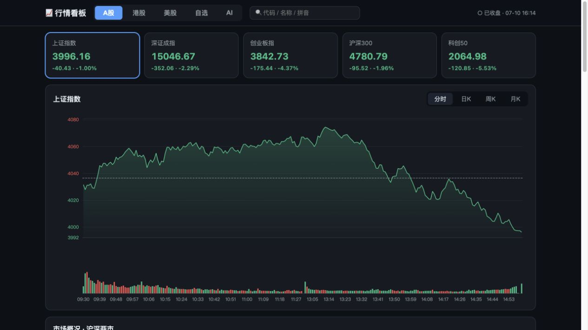
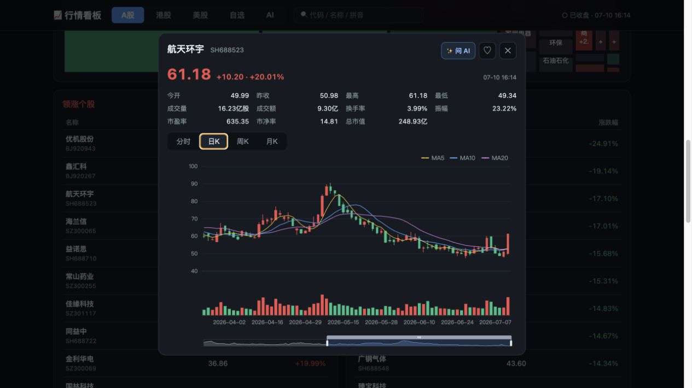
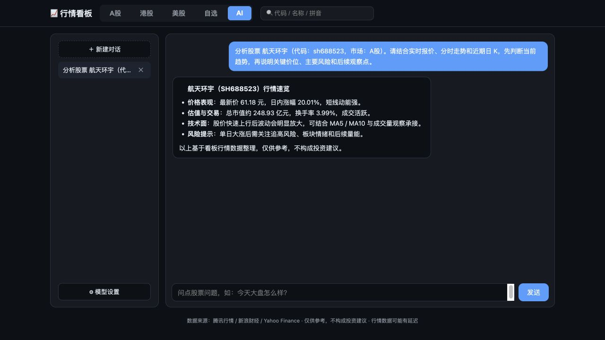
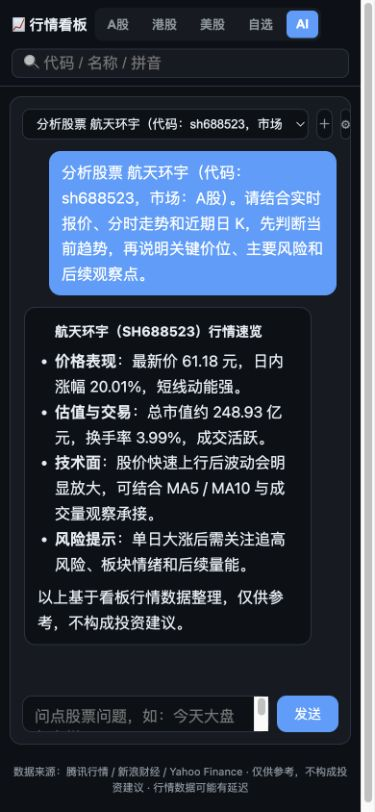
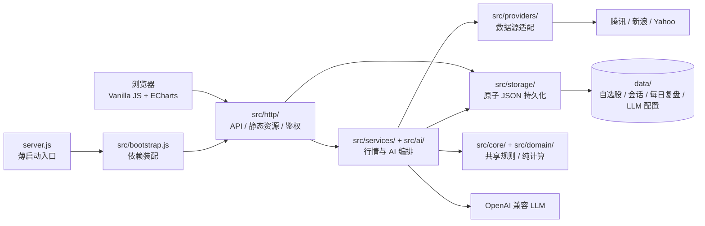

# Stock Dashboard · A股 / 港股 / 美股行情看板

一个可自托管、零 npm 依赖的多市场行情看板。聚合指数、涨跌榜、分时与 K 线、行业板块、财经新闻和自选股，并通过 OpenAI 兼容接口提供每日 AI 盘后深度复盘与带实时行情上下文的问答。


<p align="center">
  
</p>

## 核心亮点

| 能力 | 说明 |
|---|---|
| 多市场行情 | 在同一界面查看 A股、港股、美股指数、涨跌榜和个股行情 |
| 专业图表 | 分时、日 K、周 K、月 K，包含成交量和 MA5 / MA10 / MA20 |
| 个股研究卡 | 汇总 1 / 5 / 20 / 60 / 120 日复权收益、基准超额、52 周位置、波动率、最大回撤和量能 |
| AI 盘后复盘 | A股、港股、美股收盘后各生成一次结构化深度复盘；卡片展示概要，详情覆盖多周期表现、宽度与量能、行业/风格、新闻证据、风险和下个交易日观察 |
| AI 行情问答 | LLM 通过工具调用获取实时行情；官方 DeepSeek V4 会对复杂个股研究在取齐证据后自适应开启思考，简单查询保持快速；个股异动资讯要求附来源 |
| 市场洞察 | A股行业板块与资金热力图、市场涨跌家数；美股宏观资产与风险指标 |
| 自选与搜索 | 跨市场自选股；支持代码、中文、拼音和英文搜索 |
| 轻量自托管 | Node.js 原生 HTTP / fetch + 原生 JavaScript，ECharts 已自托管，无构建步骤 |
| 稳定数据层 | 请求缓存、并发合并、上游失败时旧缓存兜底；页面显式展示来源、数据时间、复权口径与缓存状态 |
| 响应式界面 | 深色主题、红涨绿跌，兼容桌面与手机浏览器 |

## 市场覆盖

| 市场 | 指数与概况 | 个股与榜单 |
|---|---|---|
| A股 | 上证指数、深证成指、创业板指、沪深300、科创50；上涨/未上涨家数、涨跌停、沪深成交额及前一交易日可比值、行业板块 | 沪深北涨跌榜、搜索、报价详情、分时与前复权 K 线 |
| 港股 | 恒生指数、国企指数、恒生科技指数；腾讯恒生指数口径大市成交额及前一交易日可比值 | 港股涨跌榜、搜索、报价详情、分时与复权 K 线 |
| 美股 | 道琼斯、纳斯达克、标普500；VIX、美债、美元、黄金、原油、比特币 | Yahoo 涨跌榜、搜索、报价详情、分时与公司行动调整 K 线 |

## 界面预览

<table>
  <tr>
    <td width="50%">
      
    </td>
    <td width="50%">
      
    </td>
  </tr>
  <tr>
    <td align="center"><strong>个股详情与「问 AI」入口</strong></td>
    <td align="center"><strong>带实时行情上下文的 AI 问答</strong></td>
  </tr>
</table>

<p align="center">
  
  <br>
  <strong>移动端自适应布局</strong>
</p>

## 快速开始

需要 Node.js 18 或更高版本；不需要 `npm install`。

```bash
git clone https://github.com/cytwyatt/stock-dashboard.git
cd stock-dashboard
node server.js
```

打开 [http://localhost:3888](http://localhost:3888)。自定义端口：

```bash
PORT=8080 node server.js
```

<details>
<summary>在同一局域网的手机上访问</summary>

让手机与电脑连接同一网络，再访问 `http://<电脑局域网 IP>:3888`。macOS 可用 `ipconfig getifaddr en0` 查看 Wi-Fi 地址。

</details>

## AI 模型配置

打开页面中的 **AI → 模型设置**，选择服务商并填写 API Key 即可。支持 DeepSeek、Kimi、通义、智谱、OpenAI，以及任意 OpenAI 兼容接口。AI 问答与盘后复盘可以使用不同模型：新的 DeepSeek 配置推荐以 `deepseek-v4-flash` 处理问答、以 `deepseek-v4-pro` 生成下一份尚未落盘的复盘；Flash 的简单问答与工具采集阶段关闭思考，绑定个股的综合分析、阶段表现、相对强弱、风险回撤、量能或操作倾向会在证据取齐后自动追加一次无工具深度综合。已有配置若没有单独的复盘模型则继续沿用问答模型，避免静默迁移。其他服务商的复盘模型留空时也沿用问答模型。

也可以通过环境变量配置：

```bash
LLM_BASE_URL=https://api.example.com/v1 \
LLM_API_KEY=your-api-key \
LLM_MODEL=your-model \
LLM_MARKET_REVIEW_MODEL=your-review-model \
node server.js
```

每个市场在收盘缓冲期后生成一次复盘，成功结果按“市场 + 交易日”写入 `data/market-reviews.json`；刷新页面、重启服务或当天更换模型都直接复用，不会重复调用模型。服务端以核心指数最后一根完整日线确定交易日，并在行情仍为旧缓存时延后生成；失败会进入 30 分钟退避，已有上一份复盘时继续展示旧卡片。A股复盘使用指数与多周期日线、上涨/未上涨家数、沪深成交额比较、行业板块、代表性涨跌样本和滚动新闻；港股加入大市成交额比较；美股加入三大指数、多周期日线、11 只行业 ETF 代理、VIX、美债、美元、黄金、原油、比特币和新闻。所有内容采用固定 JSON 结构，事件归因必须引用具体新闻来源；ETF、宏观代理和涨跌榜样本不会被冒充为全市场宽度。官方 DeepSeek V4 复盘请求会显式启用高强度思考与 JSON Output，输出上限为 32,768 token；其他 OpenAI 兼容服务使用 16,000 token 的保守上限。系统会记录完成原因、耗时、token 用量和服务端校验降级情况。

A股与港股成交额来自腾讯 `day/query` 的累计成交金额：盘中对比前一交易日同一时点，收盘后对比前一交易日收盘。A股口径为沪深合计且不含北交所；港股为腾讯恒生指数大市口径。比较基准缺失时明确降级，不补零，也不会把盘中累计额直接和前一日全日额比较。

AI 问答会按需调用行情工具获取指数、报价、K 线、研究卡、分时、板块、涨跌榜、市场概况、新闻和搜索结果。从个股入口发起的会话会持久化股票代码；询问综合分析、阶段表现、相对强弱、风险回撤、52 周位置、量能或操作倾向时，服务端会在第一次模型请求前自动附上同口径研究卡。官方 DeepSeek V4 会先以非思考模式完成最多 6 轮工具采集，再把受控证据重新封装为一次无工具的高强度思考请求；只有正常完成的终稿才会采用，超时、截断、空内容或异常工具调用都会回退到普通答案。简单报价、公告、估值、纯大盘和异动原因查询不额外思考，其他兼容端点也不会收到 DeepSeek 专属参数。遇到明显异动或询问原因时，服务端会自动检索近期个股资讯，并要求模型区分价格/风险观察与事件因果、区分直接证据与板块关联推断，并附上发布时间和来源链接。会话只保存最终答案，不保存模型思考内容；API Key 原文不会回传到浏览器（配置接口仅返回掩码）。

## 配置项

| 环境变量 | 默认值 | 用途 |
|---|---|---|
| `PORT` | `3888` | HTTP 服务端口 |
| `MARKET_DATA_DIR` | `./data` | 自选股、AI 会话、每日复盘和模型配置的存储目录 |
| `MARKET_DISABLE_REVIEW` | 未设置 | 设为 `1` 时关闭盘后复盘定时检查（用于隔离测试） |
| `MARKET_PASSWORD` | 未设置 | 可选的整站访问口令 |
| `LLM_BASE_URL` | DeepSeek 兼容地址 | 覆盖 LLM 接口地址 |
| `LLM_API_KEY` | 未设置 | 覆盖 LLM API Key |
| `LLM_MODEL` | `deepseek-v4-flash` | 覆盖 AI 问答模型；设置后也作为复盘模型的全局兼容覆盖 |
| `LLM_MARKET_REVIEW_MODEL` | 新 DeepSeek 配置推荐 `deepseek-v4-pro`；已有配置缺省沿用 `LLM_MODEL` | 单独覆盖盘后复盘模型，优先级高于 `LLM_MODEL` |

## 部署与安全

> [!WARNING]
> 服务默认不启用访问鉴权。暴露到公网前必须设置 `MARKET_PASSWORD`，并通过 HTTPS 提供访问。

- `data/` 保存自选股、AI 会话、每日盘后复盘和 LLM 配置，已被 `.gitignore` 排除。部署同步时不要覆盖该目录，并建议单独备份。
- API Key 存在服务端，读取配置时仅返回掩码；仍应将整个 `data/` 目录视为敏感数据。
- 自选股和聊天记录由当前实例的所有访问者共享，项目定位是个人或可信用户的单租户部署。
- AI 问题及工具取得的行情上下文会发送给你配置的第三方 LLM 服务商。

## 架构



`server.js` 只负责创建应用、启动服务和保留测试兼容导出；具体实现均位于 `src/`。组合根把缓存与 Yahoo 串行调度器作为同一个 runtime 管理，隔离测试则成对创建独立 runtime，避免缓存串扰或绕过上游限流。

```text
stock-dashboard/
├── server.js              # 薄启动入口与测试兼容导出
├── src/
│   ├── bootstrap.js       # 创建唯一依赖实例并装配 HTTP 服务
│   ├── core/              # 缓存、行情元数据、代码与时间规则
│   ├── domain/
│   │   └── research-card.js  # 研究卡纯金融计算
│   ├── storage/           # 自选、LLM 配置与会话的原子 JSON 持久化
│   ├── providers/         # 腾讯、新浪、Yahoo 数据获取与解析
│   ├── services/          # 市场路由、统一缓存、研究/资讯与预热
│   ├── ai/                # LLM 客户端、工具、提示词、证据与对话编排
│   └── http/              # 鉴权、路由、响应与静态资源
├── llm.json.example       # OpenAI 兼容模型配置示例
├── public/
│   ├── index.html
│   ├── app.js             # 页面状态、图表、搜索、自选与 AI 交互
│   ├── style.css          # 深色主题与响应式布局
│   └── vendor/            # 自托管 ECharts
├── tests/                  # Node.js 内置测试的回归用例
├── docs/screenshots/      # README 产品截图
└── data/                  # 运行时数据，不进入 Git
```

## 数据来源

| 数据 | 来源 |
|---|---|
| A股 / 港股指数、报价、分时与 K 线 | 腾讯行情 |
| A股行业板块与资金流 | 腾讯行情 |
| A股 / 港股涨跌榜 | 新浪财经 |
| A股个股候选相关资讯 | 新浪财经个股资讯 |
| 美股指数、报价、分时、复权 K 线与涨跌榜 | Yahoo Finance |
| 财经新闻 | 新浪财经滚动 |

行情数据会根据类型缓存 15 秒至 10 分钟；每日盘后复盘成功生成后持久化复用，失败时按 30 分钟退避重试。上游异常时服务端会尽量返回带 stale 标记的旧行情缓存；核心指数或日线仍为旧缓存时不会固化当日复盘。免费公开接口可能限流、延迟或调整格式。

### 行情口径与元数据

- 行情 API 统一返回 `{ data, meta }`。`meta` 包含 `source`、ISO 4217 `currency`、`timezone`、`asOf`、`fetchedAt`、`stale` 和 `adjustmentBasis`；前端公共请求函数会自动解包。
- 有上游时间时，`asOf` 表示数据对应时间；上游未提供时 `asOfBasis='fetch_time'`，页面明确显示为“抓取”而非“截至”。`fetchedAt` 是本服务最近一次成功抓取时间。刷新失败并返回旧缓存时，`stale=true`，时间不会被伪装成当前值。
- 金额字段统一使用对应币种的基础单位（元、港元、美元），不再混用“万元/亿元”；界面负责转换成万、亿等显示单位。
- A股和港股 K 线使用腾讯前复权数据（`provider_qfq`）；美股以 Yahoo adjusted close 的因子同步调整整根 OHLC（`split_dividend_adjusted`）。复权数据缺失时会标为 `raw_fallback`，不会冒充复权数据。成交量保持供应商原始口径。
- 个股详情中的研究卡以复权日线计算，默认用沪深300、恒生指数、标普500作为各市场基准。停牌日按基准交易日历向前延用最近收盘价；超额收益是个股与价格指数简单收益率的百分点差，不代表风险调整后 Alpha。
- 20 日波动率使用简单日收益的样本标准差并按 252 个交易日年化；最大回撤取近 120 个市场交易区间；二者及量能均排除盘中未完成日。52 周区间必须覆盖完整 365 个自然日；量能为最近完整交易日成交量相对此前 20 日均量。
- 腾讯行业接口只提供“上涨家数/总家数”，因此市场宽度诚实显示“上涨/未上涨”；“未上涨”包含下跌、平盘与停牌，不能解释为真实下跌家数。
- 行业“主力净流入”是腾讯供应商估算口径，页面和 AI 均标为估算值，不代表可核验的实际资金流。
- AI 盘后复盘的 `偏强 / 中性 / 偏弱 / 分化` 只描述已完成交易日的盘面状态，不代表后市预测；港股和美股缺少真实全市场宽度时会降低证据质量并明确代理或样本覆盖边界。
- 美债收益率同时保留收益率水平和相对前收的基点变化；VIX、美元指数等使用指数点位语义，不作为美元价格，也不能单独证明股票市场涨跌原因。

## 测试

项目使用 Node.js 内置测试工具，不增加 npm 依赖：

```bash
node --test tests/*.test.js
```

## 自定义

- 指数列表：A股/港股修改 `src/providers/tencent.js`，美股修改 `src/providers/yahoo.js`。
- 刷新频率：修改 `public/app.js` 底部的定时刷新逻辑。
- 界面主题：修改 `public/style.css` 顶部的 CSS 变量。

## 免责声明

本项目仅用于信息展示与技术研究。行情数据可能存在延迟或误差，AI 输出也可能不准确；所有内容均不构成投资建议。
