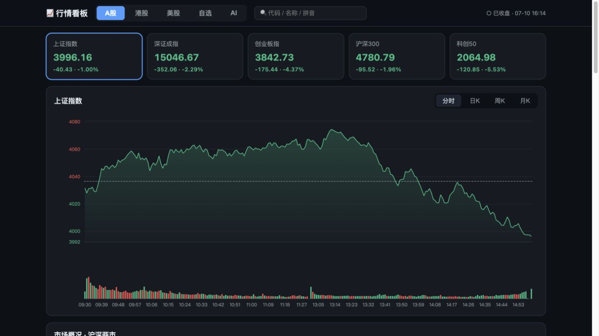
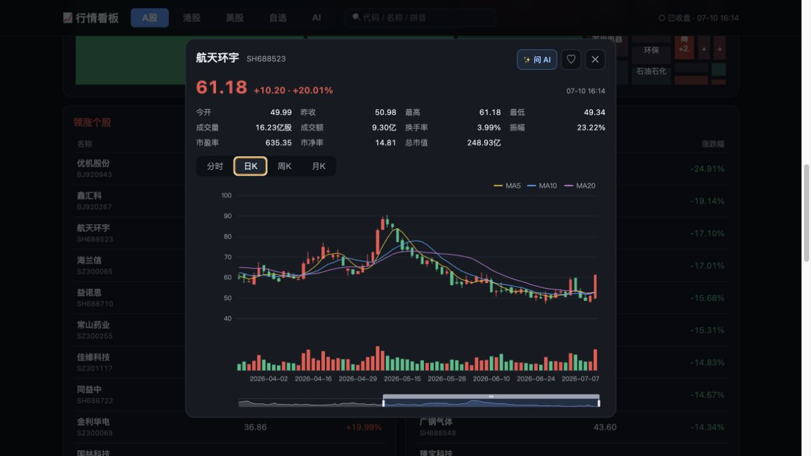
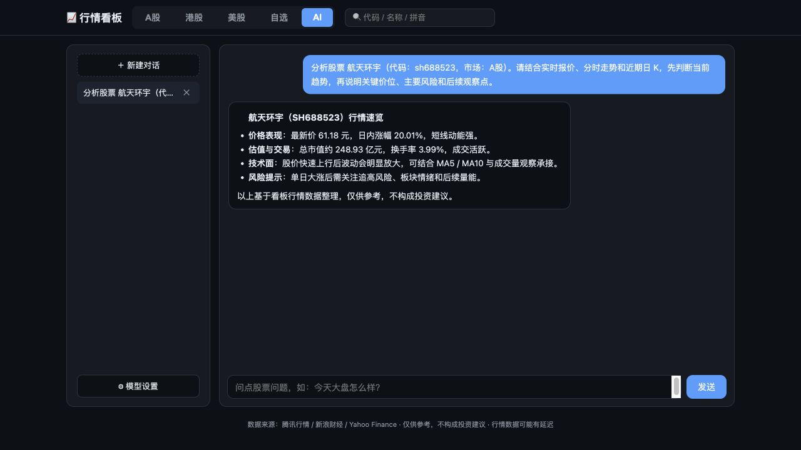
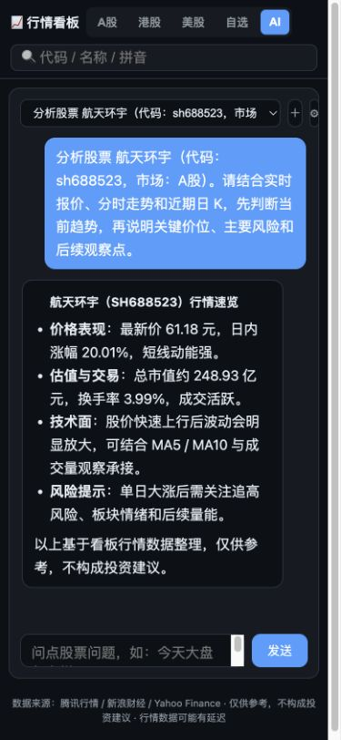

# Stock Dashboard · A股 / 港股 / 美股行情看板

一个可自托管、零 npm 依赖的多市场行情看板，集成行情、个股研究、每日 AI 盘后复盘和带实时数据的 AI 问答。


<p align="center">
  
</p>

## 主要功能

| 能力 | 说明 |
|---|---|
| 多市场行情 | A股、港股、美股指数、美股盘前/盘后报价与分时、成交额对比、带行业涨跌榜、复权 K 线，支持跨市场搜索和自选 |
| 个股研究 | 行业、主营业务、多周期收益、基准超额、52 周位置、波动率、回撤和量能 |
| AI 盘后复盘 | 每个市场每个交易日生成一次，展示模型对当日走势的明确判断、跨数据主线、风险与未来一至五个交易日情景 |
| AI 行情问答 | 模型可按需调用行情、K 线、研究卡和资讯工具；明显异动会自动补充带来源的事件线索 |
| 市场洞察 | A股行业与资金热力图，美股行业 ETF、VIX、美债、美元、黄金、原油和比特币代理指标 |
| 轻量自托管 | Node.js 原生 HTTP / fetch + Vanilla JavaScript，ECharts 本地托管，无构建步骤 |

<details>
<summary>更多界面截图</summary>

<table>
  <tr>
    <td></td>
    <td></td>
  </tr>
</table>

<p align="center">
  
</p>

</details>

## 快速开始

需要 Node.js 18 或更高版本，不需要 `npm install`。

```bash
git clone https://github.com/cytwyatt/stock-dashboard.git
cd stock-dashboard
node server.js
```

打开 [http://localhost:3888](http://localhost:3888)。修改端口：

```bash
PORT=8080 node server.js
```

## AI 模型配置

在页面中打开 **AI → 模型设置**，填写 API Key 即可。支持 DeepSeek、Kimi、通义、智谱、OpenAI 及其他 OpenAI 兼容接口。

问答与盘后复盘可使用不同模型。DeepSeek 用户推荐两者统一使用
`deepseek-v4-flash`，覆盖日常问答、工具调用和盘后复盘。

也可使用环境变量：

```bash
LLM_BASE_URL=https://api.example.com/v1 \
LLM_API_KEY=your-api-key \
LLM_MODEL=your-model \
LLM_MARKET_REVIEW_MODEL=your-review-model \
node server.js
```

盘后复盘按“市场 + 交易日”持久化，刷新、重启或当日更换模型都不会重复调用。AI 输出只作为条件式情景参考，不提供目标价、涨跌概率、买卖或仓位建议。

### ChatGPT 订阅 / Codex（实验性，个人自用）

模型设置中可切换至 **ChatGPT 订阅 / Codex**。此模式使用服务器上 Codex 的 ChatGPT 登录，不把订阅转换成通用 API Key；原 API 地址、模型和密钥单独保留，只有手动切回 API 模式才会使用。

1. 在运行看板的同一服务器用户下安装官方 **Codex CLI 0.151.0**，通过 `codex login --device-auth` 登录。其他版本会拒绝运行，升级需重新验证协议与权限边界。
2. 在模型设置选择订阅模式，填写账号可用的 Codex 模型（默认 `gpt-5.6-luna`、低推理强度），可单独指定下一份复盘的模型。
3. “保存并检查登录 / 额度”只检查账号、模型、配置和订阅额度，不生成测试回答。检查通过后即可问答；启用模式后的下一份到期复盘也使用 Codex。

后端使用 Node 内置子进程与私有 stdio，不额外监听 RPC 端口、不引入 npm SDK。每次推理使用临时工作目录、临时会话与最小只读权限，关闭命令、网络工具、插件、记忆、hooks 和子代理。启用的外部 MCP 或非官方 OpenAI 路由会导致接入被拒绝；建议使用专用服务器账号。网页不提供命令、工作目录、登录令牌或可执行文件配置入口。

Codex 只返回结构化答案或查询请求；行情查询继续由看板的白名单工具执行，保留最近 12 条消息、最多 6 轮调用、自动研究卡/资讯证据及复盘校验。超时、页面连接断开或协议异常会结束专属进程，不保存不完整答案。单实例同时最多一个 Codex 推理，多余请求提示稍后重试。

**费用和稳定性限制：** 与日常 Codex 共享订阅额度；额度未知或任一额度窗口的账号共享用量达到 50% 时暂停新调用，不自动回退到付费 API、购买额度或兑换重置。此检查不是账户级消费硬上限：并发在其他客户端使用、单次长回答或账户已有加购额度仍可能影响计费。App Server 没有等价的每请求 `max_tokens` 硬限制；本适配器限制时间/输入/输出长度，并在返回 token 用量超标时拒绝保存，但不能撤销已消耗额度。官方仍将 App Server 标为实验性，不支持生产工作负载，不能承诺长期稳定。

参考：[官方 App Server 文档](https://learn.chatgpt.com/docs/app-server)、[登录方式](https://learn.chatgpt.com/docs/auth)、[额度说明](https://learn.chatgpt.com/docs/pricing)。

## 常用配置

| 环境变量 | 默认值 | 用途 |
|---|---|---|
| `PORT` | `3888` | HTTP 服务端口 |
| `MARKET_DATA_DIR` | `./data` | 运行时数据目录 |
| `MARKET_PASSWORD` | 未设置 | 可选的整站访问口令 |
| `LLM_BASE_URL` | DeepSeek 兼容地址 | LLM 接口地址 |
| `LLM_API_KEY` | 未设置 | LLM API Key |
| `LLM_MODEL` | `deepseek-v4-flash` | AI 问答模型 |
| `LLM_MARKET_REVIEW_MODEL` | 沿用问答模型 | 单独指定盘后复盘模型 |
| `LLM_TRANSPORT` | 文件配置或 `api` | 可选 `api` / `codex`；设置后页面不能切换模式 |
| `MARKET_CODEX_BIN` | 自动寻找 Codex | 仅服务器环境变量可指定 CLI 的绝对路径 |

## 数据来源

| 数据 | 来源 |
|---|---|
| A股 / 港股指数、报价、分时与 K 线 | 腾讯行情 |
| A股行业、A股 / 港股涨跌榜与公司资料 | 腾讯行情 / 新浪财经 |
| 美股常规/盘前/盘后行情、复权 K 线、涨跌榜与个股资讯 | Yahoo Finance |
| 美股行业与公司简介 | Nasdaq |
| A股个股资讯与财经新闻 | 新浪财经 |

所有行情 API 都附带数据来源、时间、币种、复权口径和缓存状态。上游失败时会尽量返回明确标记的旧缓存；免费公开数据源仍可能限流、延迟或调整格式。

## 数据与安全

> [!WARNING]
> 服务默认不启用鉴权。暴露到公网前，请设置 `MARKET_PASSWORD` 并通过 HTTPS 访问。

- `data/` 保存自选股、AI 会话、每日复盘和模型配置，已被 Git 忽略；部署和备份时请单独处理。
- API Key 只保存在服务端，配置接口仅返回掩码。
- 自选股和会话由当前实例的所有访问者共享，项目定位是个人或可信用户的单租户部署。
- AI 问题及相关行情上下文会发送给你配置的第三方 LLM 服务商。

## 技术结构

```text
server.js       启动入口
src/http/       HTTP、静态资源与鉴权
src/services/   行情缓存与业务编排
src/providers/  腾讯、新浪、Yahoo、Nasdaq 适配
src/ai/         LLM、工具调用与盘后复盘
src/storage/    JSON 持久化
public/         Vanilla JavaScript + ECharts 前端
tests/          Node.js 内置测试
```

## 测试

```bash
node --test tests/*.test.js
```

## 免责声明

本项目仅用于信息展示与技术研究。行情数据和 AI 输出可能存在延迟或误差，所有内容均不构成投资建议。
